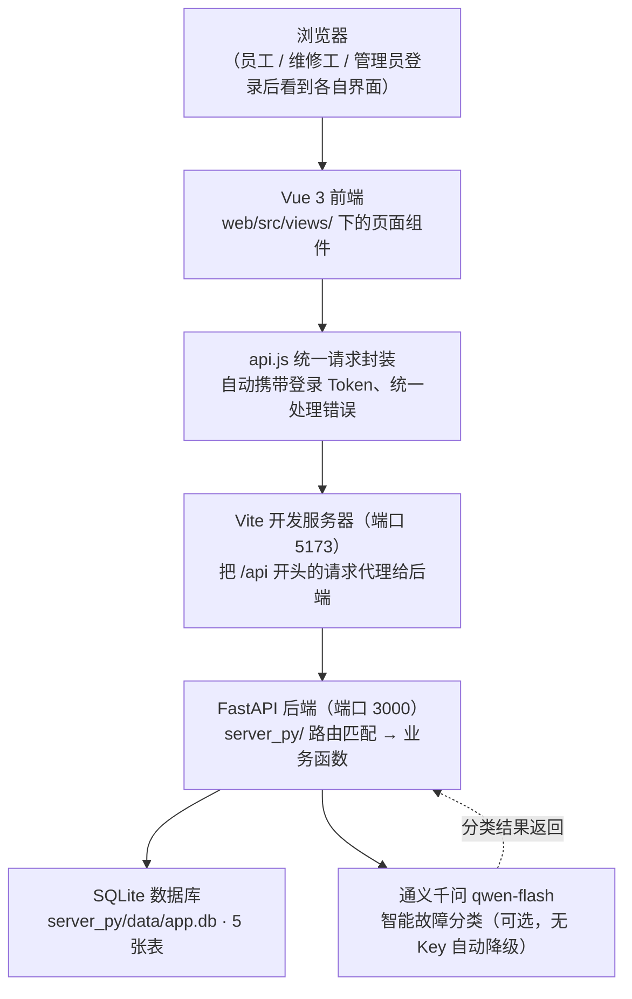
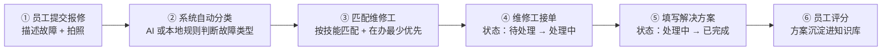
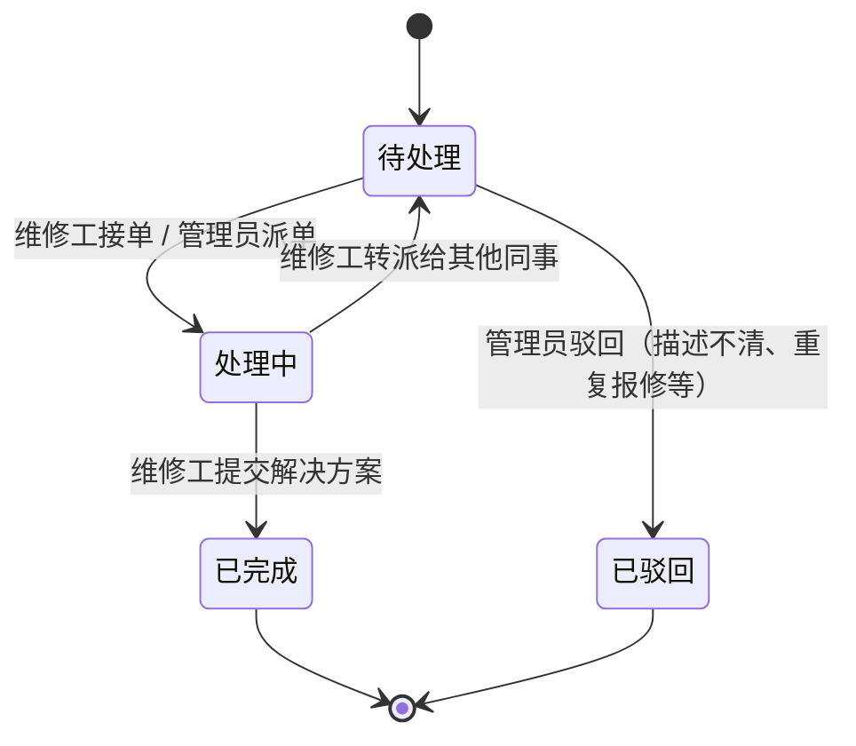
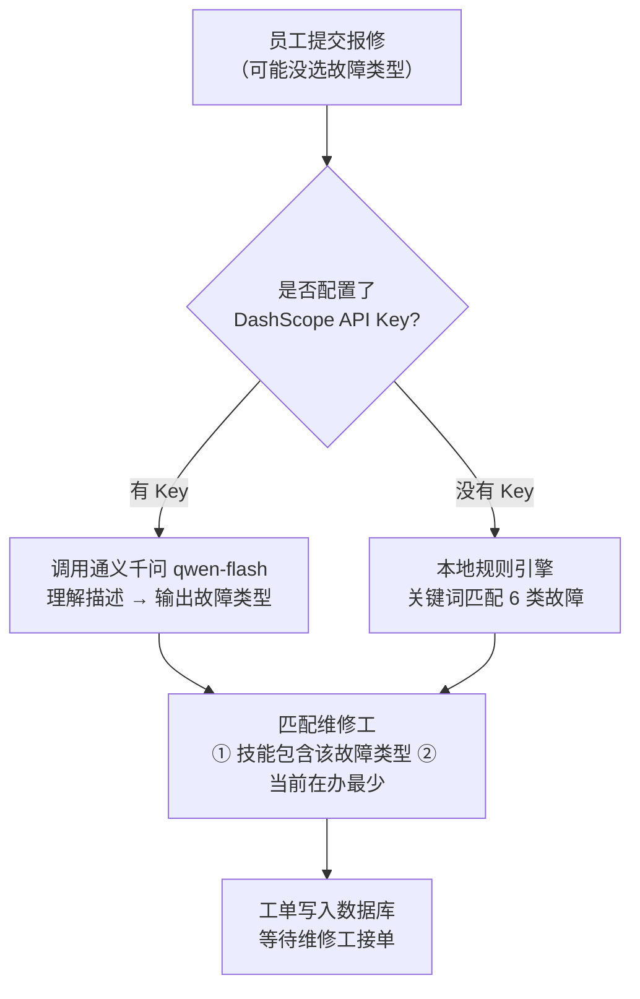

# xxx公司智能报修系统

一个给企业用的**在线报修平台**：员工遇到电脑坏了、空调不制冷，不用再打电话找人，打开网页提交一条报修单；系统自动把故障分类、派给会修的维修工；修完还能沉淀成"维修知识"，下次同类问题直接秒级定位。

一句话技术画像：**Vue 3 + FastAPI 前后端分离 + SQLite 单机部署 + AI 智能派单**，前后端通过"URL + JSON"契约通信，前端零依赖后端语言，可整体替换。

---

## 1. 它解决什么问题

传统报修靠电话、微信、纸质单子，经常出现：找不到人、不知道找谁、修没修不知道、同一故障反复报。

这个系统把流程搬到线上，三个角色各管一段：

| 角色 | 登录账号 | 能做什么 |
|---|---|---|
| **员工** | chenxiao / 123456 | 提交报修、查看自己的工单进度、催办、修完后评分 |
| **维修工** | zhangwei / 123456 | 看到"待处理大厅"的工单、接单、填写解决方案、把不会的转派出去 |
| **管理员** | admin / admin123 | 看全部工单、手动派单/驳回、查看统计看板 |

---

## 2. 系统架构总览

下面这张图是整个系统的心脏——**一个请求从浏览器出发，经过前端、代理、后端，最后落到数据库**：



**各层一句话解释：**

| 层 | 技术 | 在项目里的位置 | 大白话职责 |
|---|---|---|---|
| 页面层 | Vue 3 | `web/src/views/` | 画界面、响应点击 |
| 请求层 | api.js（fetch 封装） | `web/src/api.js` | 拼 URL、带 Token、统一报错 |
| 开发服务器 | Vite | `web/vite.config.js` | 送页面 + 把 `/api` 转给后端 |
| 接口层 | FastAPI + Uvicorn | `server_py/` | 路由匹配、参数校验、权限控制 |
| 数据层 | SQLite | `server_py/data/app.db` | 存用户、工单、设备、知识 |
| 智能层 | 千问 + 本地规则 | `server_py/llm.py` `smart.py` | 自动分类故障、推荐维修工 |

> 开发时两个服务器同时跑（前端 5173、后端 3000）；上线后前端被构建成静态文件，由后端同一个端口直接托管，所以**生产环境只有一个服务**。

---

## 3. 一次报修的完整旅程

从员工点"提交"到员工点"完成"，工单走完一个闭环：



每一步都有后端状态校验：**工单不能乱跳状态**（比如"待处理"不能直接变"已完成"），非法的迁移会被后端直接拦截——这是防止流程乱套的保险丝。

### 工单状态机



---

## 4. 智能分类是怎么工作的

系统对"这是什么故障、该派给谁"做了**双保险**：



- **配置了 Key**：走大模型，理解力更强（能读懂"开机一直转圈"= 电脑故障）
- **没配置 Key**：走本地关键词规则，系统依然完整可用
- **完工沉淀**：每次修完的方案会存进 `knowledge` 表，构成"企业自己的维修知识库"

---

## 5. 技术栈总览

| 分类 | 技术 | 版本要求 | 说明 |
|---|---|---|---|
| 前端框架 | Vue 3 + Vite | Node.js 18+ | 组件化开发，`.vue` 单文件组件 |
| 前端请求 | 原生 fetch | — | 无第三方请求库，`api.js` 统一封装 |
| 后端框架 | FastAPI + Uvicorn | Python 3.10+ | 自动生成接口文档、类型校验 |
| 数据库 | SQLite | 内置 | 零配置、单文件，适合内部系统 |
| 密码存储 | hashlib.scrypt | Python 标准库 | 加盐哈希，与 Node 版参数一致 |
| 智能分类 | 通义千问 qwen-flash | 需 DashScope Key | 无 Key 自动降级本地规则 |

---

## 6. 项目结构

```
xxx公司智能报修业务/
├── server_py/                 # FastAPI 后端（Python）
│   ├── main.py                # 入口：路由挂载、异常处理器、静态托管
│   ├── auth.py                # 登录 Token + 依赖注入（require_auth / require_role）
│   ├── security.py            # 密码哈希与校验（scrypt）
│   ├── db.py                  # SQLite 建表、种子数据、线程安全封装
│   ├── llm.py                 # 大模型调用（千问）
│   ├── smart.py               # 本地规则引擎（关键词分类 + 技能匹配派单）
│   ├── errors.py              # 统一业务异常 ApiError
│   ├── routers/
│   │   ├── auth.py            # 登录 / 登出 / 当前用户
│   │   ├── tickets.py         # 工单 CRUD + 状态机流转
│   │   ├── smart.py           # 智能分类 / 推荐派单接口
│   │   └── meta.py            # 设备、维修工、故障类型、统计
│   ├── requirements.txt       # Python 依赖清单
│   └── config.example.json    # API Key 配置模板（真实 key 不入库）
└── web/                       # Vue 3 前端
    ├── src/
    │   ├── api.js             # 唯一请求出口：拼 URL、带 Token、统一错误
    │   ├── store.js           # 登录态管理（token + user）
    │   ├── router/            # 前端路由（登录后跳转对应角色页面）
    │   ├── views/             # Login / Employee / Worker / Admin 页面
    │   └── components/        # 通用组件
    ├── index.html
    ├── package.json
    └── vite.config.js         # 开发代理：/api → localhost:3000
```

---

## 7. 快速开始（5 分钟跑起来）

### 第一步：启动后端

```bash
cd server_py
pip install -r requirements.txt
python main.py        # 或者 uvicorn main:app --port 3000
```

看到 `Uvicorn running on http://0.0.0.0:3000` 即成功。此时打开 `http://localhost:3000/docs`，能看到 FastAPI 自动生成的**接口文档**，每个接口都可以直接在线测试。

> 可选：配置智能分类的 API Key（不配置也能跑，自动用本地规则）
>
> ```bash
> cp config.example.json config.json
> # 用编辑器打开 config.json，把 "dashscopeApiKey" 填成阿里云百炼的 Key
> ```

### 第二步：启动前端（另开一个终端）

```bash
cd web
npm install
npm run dev
```

浏览器打开 `http://localhost:5173`，用下面的演示账号登录即可。

### 第三步（可选）：生产模式

```bash
cd web && npm run build    # 生成 web/dist
# 后端检测到 web/dist 存在后，会自动在同一端口托管前端页面
# 此时只需启动后端一个服务，访问 http://localhost:3000 即可
```

### 常见问题

| 问题 | 原因与解决 |
|---|---|
| 前端能开，但登录提示"请求失败" | 后端没启动，或端口被占用。确认 `python main.py` 在跑、3000 端口空闲 |
| 提交报修没反应 | 看后端终端报错——最常见是 API Key 没配导致走了本地规则（正常现象），或数据库目录无写权限 |
| 登录提示"用户名或密码错误" | 确认账号大小写，演示账号见下表 |

---

## 8. 演示账号

| 角色 | 用户名 | 密码 | 能做的事 |
|---|---|---|---|
| 管理员 | admin | admin123 | 全量工单、手动派单、驳回、统计看板 |
| 员工 | chenxiao | 123456 | 提交报修、催办、评价（另有 liuyang / zhaomin / sunlei） |
| 维修工 | zhangwei | 123456 | 接单、处理、转派（另有 liqiang / wangfang） |

---

## 9. 安全说明

- **API Key 永不入库**：真实 Key 放在 `server_py/config.json`，已被 `.gitignore` 排除；仓库里只有 `config.example.json` 模板。克隆项目后需自行创建 `config.json`
- **密码安全**：scrypt 加盐哈希存储，不存明文
- **登录态**：随机 64 位十六进制 Token 存 `sessions` 表，请求头 `Authorization: Bearer <token>` 携带
- **权限控制**：后端依赖注入统一校验角色（员工只能看自己的工单、维修工只能接单/处理、管理员全量），前端无法绕过

---

## 10. 接口文档

启动后端后访问 **`http://localhost:3000/docs`**——FastAPI 自动生成、实时同步代码，支持在线试调，是了解全部接口的最快入口。

---

> 本项目为单机部署的内部系统形态，数据规模适合百人以内团队。如需多用户并发、云端部署或权限体系扩展，可在此基础上演进。
